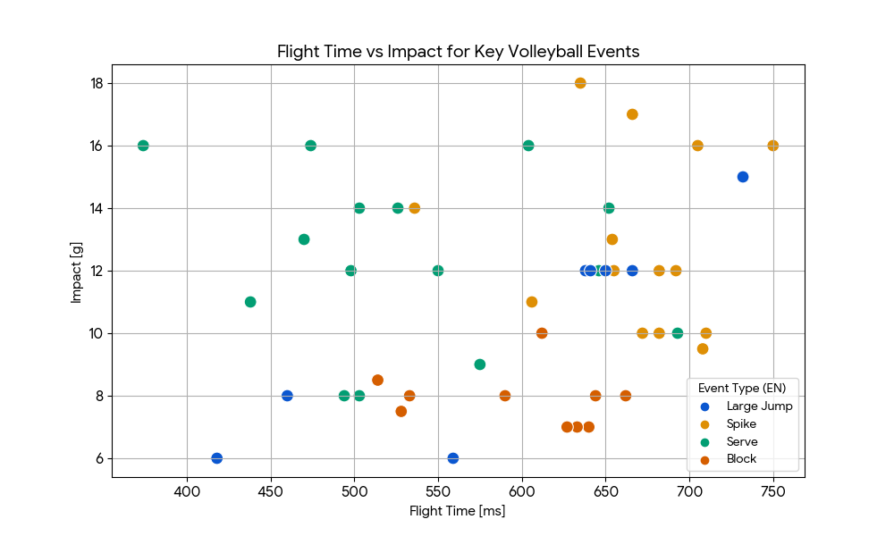

# IMU Event Detection for Volleyball

Biomechanical event detection system: analyzing true global acceleration from wearable IMU sensors to accurately classify volleyball actions (spikes, blocks, serves).

## Overview
This project processes raw data from a single IMU sensor (Inertial Measurement Unit) worn by a volleyball player to detect and classify complex jumping events. 

A major challenge with IMU data in sports is the high noise level generated by impacts, vibrations, and movement of the sensor housing, making simple threshold-based detection unreliable. This algorithm solves the noise issue by mapping the local sensor data to a **true global coordinate system** and utilizing an engineered "Freefall Threshold" to precisely isolate the biomechanical `Toe-off` phase.

## Key Features
* **Global Acceleration Mapping:** Converts raw local axes to an absolute global Z-axis (gravity-aligned), negating the effect of the player's torso angle during flight.
* **Robust Jump Detection:** Employs a custom `0.3G` freefall threshold and dynamic cooldowns to accurately measure true flight time, completely ignoring false peaks from muscle loading and floor impacts.
* **Event Classification:** By analyzing the relationship between the flight time (`ms`) and the landing impact (`g-force`), the system can classify the event:
  * **Spikes (הנחתות) / Serves (סרבים):** High flight time + High impact.
  * **Blocks (חסימות):** High flight time + Moderate/Low impact (due to controlled, symmetrical two-footed landings).
  * *See the scatter plot below for the clear clustering of these events based on the extracted features.*

## Data Visualization
The extracted features (Flight Time vs. Landing Impact) create distinct biomechanical signatures for different volleyball actions:

## Repository Structure
* `jump-detection.py`: The core `VolleyballJumpDetectorGlobal` class containing the event detection and parameter evaluation logic.
* `helpers.py`: The physics engine responsible for dynamic gravity filtering, low-pass filtering, and global vector projection.
* `data/`: Contains sample `.csv`/`.txt` files with raw IMU data from an actual volleyball session.
* `requirements.txt`: Python dependencies required to run the pipeline.

## How to Run
1. Clone the repository.
2. Install the requirements: `pip install -r requirements.txt`
3. Ensure the sample data path in `jump-detection.py` points to a file in the `data/` folder.
4. Run the script: `python jump-detection.py` to process the data and visualize the events.

## Tech Stack
* **Language:** Python
* **Data Processing:** Pandas, NumPy, SciPy (Signal Processing)
* **Visualization:** Matplotlib, Seaborn
